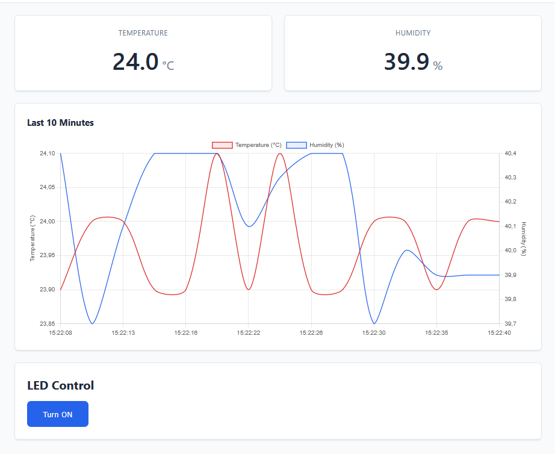
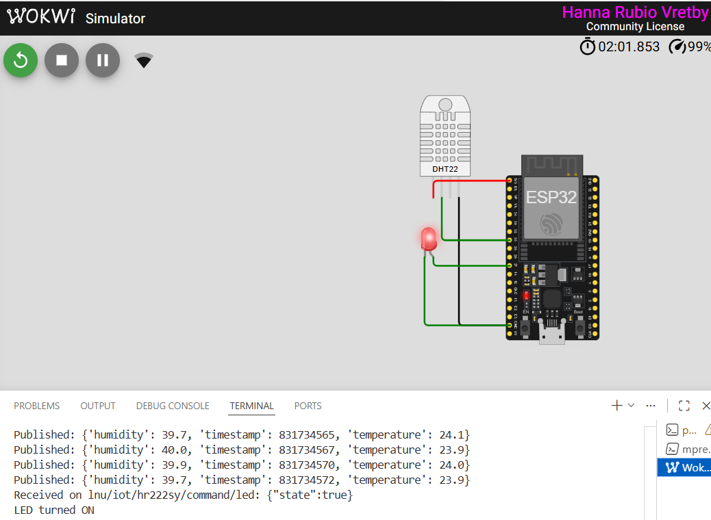
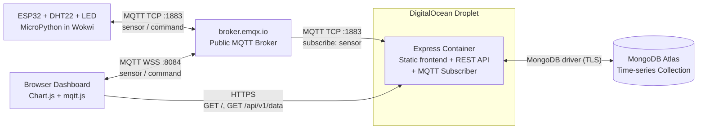

# 🌡️ IoT Dashboard

[](https://nodejs.org/)
[](https://expressjs.com/)
[](https://micropython.org/)
[](https://mqtt.org/)
[](https://www.mongodb.com/atlas)
[](https://www.docker.com/)
[](LICENSE)

> 📚 This project was developed as part of the course **1DV027 — The Web as an Application Platform** at Linnaeus University (LNU).

An end-to-end IoT pipeline that simulates an ESP32 device publishing temperature and humidity readings via MQTT. The dashboard combines historical visualization with real-time updates and bidirectional device control, persisting time-series data in MongoDB.

**Live Dashboard:** https://iot-dashboard-hr222sy.duckdns.org  
**Wokwi Simulation:** https://wokwi.com/projects/463274235615279105

---

## Features

- ESP32 simulation with DHT22 sensor and LED running MicroPython firmware in Wokwi
- Real-time sensor monitoring via MQTT over WebSockets (WSS) — no polling
- Dual-axis line chart with both historical and live data (Chart.js)
- Bidirectional device control — toggle the LED from the dashboard
- Time-series data persistence with automatic 7-day retention
- Same-origin deployment — Express serves both API and static frontend
- Resilient firmware that gracefully handles broker disconnects and sensor errors

---

## Screenshots

### Dashboard


### Wokwi Simulation


---

## Tech Stack

| Layer | Technology | Purpose |
|---|---|---|
| Device | ESP32 + DHT22 + LED, MicroPython | Sensor simulation in Wokwi |
| Messaging | MQTT 5 (TCP for device, WSS for browser) | Pub/sub message bus via `broker.emqx.io` |
| Back-end | Node.js 22 + Express 5 (ESM) | REST API, MQTT subscriber, static file serving |
| Database | MongoDB Atlas (time-series collection) | Sensor data persistence with 7-day TTL |
| Front-end | Vanilla JS + ES modules | Component composition without a framework |
| Visualization | Chart.js 4 | Dual-axis temperature and humidity line chart |
| MQTT client (browser) | mqtt.js 5 | WSS subscription and command publishing |
| Deployment | Docker + nginx + DigitalOcean | Containerized HTTPS deployment |
| Code quality | ESLint 9 (flat config), Prettier | Linting and formatting |

---

## Architecture

The system has three external services (MQTT broker, device simulator, MongoDB) and one self-hosted component: a Docker container running Express that serves both the dashboard and the historical REST API.



The browser receives realtime data and sends commands directly through the broker over WSS, while the backend handles persistence and serves a sliding 10-minute window of historical data on initial load via `GET /api/v1/data?minutes=10`.

---

## Getting Started

### Prerequisites

- Node.js v22+
- A MongoDB Atlas account (or local MongoDB 5.0+ for time-series support)
- VS Code with the Wokwi extension (for running the device simulation locally)

### Installation

```bash
git clone https://github.com/HannaRV/iot-dashboard.git
cd iot-dashboard/backend
npm install
```

### Environment Variables

Create a `.env` file in `backend/` based on `.env.example`:

```env
MONGODB_URI=your_mongodb_connection_string
DB_NAME=iot_dashboard
HTTP_PORT=3000
MQTT_BROKER=mqtt://broker.emqx.io:1883
MQTT_PORT=1883

```

### Run the Application

Start the backend (serves both the API and the static frontend):

```bash
npm run dev
```

The application will be available at `http://localhost:3000`.

To run the device simulation, open `wokwi/diagram.json` in VS Code and start the Wokwi simulator.

No separate frontend build step is required — Express serves the static frontend files directly via `express.static`.

---

## Security

| Measure | Implementation |
|---|---|
| Transport | HTTPS (TLS 1.3) via Let's Encrypt for the dashboard; TLS for MongoDB driver |
| Input validation | MQTT payloads and API query parameters validated; invalid input logged and discarded |
| Output safety | DOM updates use `textContent` only (never `innerHTML`), preventing XSS from message contents |
| Secrets | `.env` excluded from Git and the Docker image; configuration recursively frozen with `Object.freeze` |
| Supply chain | CDN libraries (Chart.js, mqtt.js) pinned with Subresource Integrity (SRI) hashes |
| Resilience | Firmware `try/except` per blocking call with reconnect-with-backoff; backend graceful shutdown on `SIGINT`/`SIGTERM` |
| Container | Docker `--restart unless-stopped`; runtime as non-root `USER node` |

---

## Deployment

The application is deployed on a DigitalOcean droplet using Docker and nginx:

```bash
# Build and run the container
docker build -t iot-dashboard .
docker run -d --name iot-dashboard \
  --restart unless-stopped \
  -p 3002:3000 \
  --env-file backend/.env \
  iot-dashboard
```

nginx terminates TLS via a Let's Encrypt certificate and reverse-proxies all traffic to the container, which serves both the static frontend and the REST API at `/api/v1`.

---

## Acknowledgements

- Course examples and guidance by Oxana Sachenkova (LNU) and Alisa Lincke (LNU)
- Wokwi ESP32 starter project from the course Moodle
- [broker.emqx.io](https://www.emqx.com/en/mqtt/public-mqtt5-broker)
- [Chart.js documentation](https://www.chartjs.org/docs/latest/)
- [mqtt.js documentation](https://github.com/mqttjs/MQTT.js)
- [MongoDB time-series documentation](https://www.mongodb.com/docs/manual/core/timeseries-collections/)

---

## Author

**Hanna Rubio Vretby**  
hr222sy@student.lnu.se  
Linnaeus University