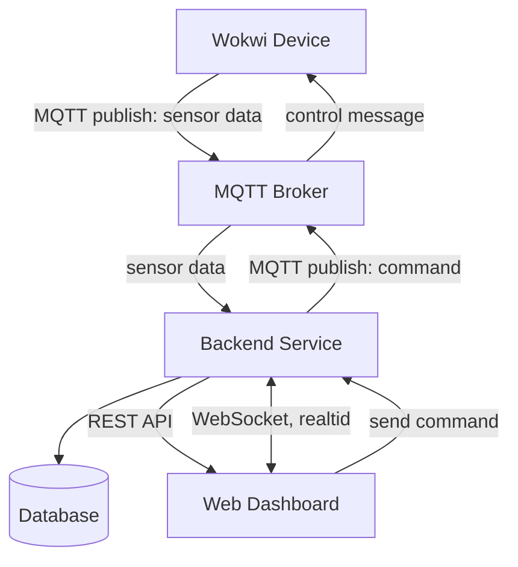

# iot-dashboard


## Submission Report Template

Include the following sections in your report:

### 1) Project Links
- **Live Dashboard URL:** [Link to deployed frontend, e.g. Vercel/Netlify/Cumulus]
- **Wokwi Simulation URL:** [Public Wokwi project link]
- **Backend/Database URL:** [Link to deployed backend stack, if applicable]
- **Repository URL:** [https://github.com/HannaRV/iot-dashboard]

### 2) Project Overview
Briefly describe:
- What your project does.
- Which hardware/sensors you simulated.
- What the dashboard allows the user to monitor/control.

### 3) Architecture and Data Flow
Explain how data moves through your system:
- Wokwi device -> MQTT broker -> processing layer/database -> dashboard.
- Dashboard -> MQTT command topic -> device action.

Use the placeholder below and replace it with your own architecture screenshot or diagram:

```md
[Insert architecture diagram or screenshot here]
```

Your diagram must explicitly label the communication protocols used between components (for example MQTT, WebSocket, HTTP/HTTPS).

Example Mermaid diagram (you can copy and adapt):



### 4) Database Strategy
Document:
- **Database chosen:** (for example InfluxDB, MongoDB, TimescaleDB)
- **Data model:** measurement/collection/table structure
- **Time-series considerations:** retention, indexing, query strategy, aggregation, etc.

### 5) MQTT Topics and Payload Documentation
List all topics used and provide example payloads. This should be precise enough to serve as integration documentation for your device and dashboard communication.

### 6) Reflection
Answer the following:
1. Which frontend technologies did you choose, and why?
2. How does handling real-time MQTT data over WebSockets differ from a standard REST API workflow?
3. What was the most challenging integration step (hardware, broker, backend, database, frontend), and how did you solve it?

## Hand-in Instructions

Submit your work by creating a Merge Request targeting the `lnu/submit-branch`.

If you used additional repositories or external services, include links to them in your submission report.

## Grade Levels

- **G:** Complete all mandatory requirements in this README.
- **VG:** Complete all mandatory requirements **and** at least one optional VG extension.

### Grading Policy Mapping

- **Mandatory (G) mapping:** Equivalent to completing Issue 1-7 in `ISSUES.md`.
- **Issue 4 path rule:** You must complete either Path A (custom API) or Path C (Node-RED historical access), and document your chosen approach.
- **Optional (VG) mapping:** Equivalent to completing at least one of VG-A, VG-B, or VG-C in `ISSUES.md`.

For any VG extension, include:
- Security considerations (secrets handling, credentials, access restrictions).
- Evidence (screenshots/video/logs) and short technical reflection.


