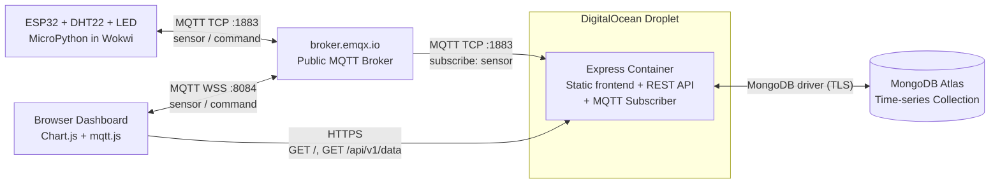

# IoT Dashboard

End-to-end IoT pipeline: Wokwi-simulated ESP32 publishes sensor data via MQTT to a Node.js backend with MongoDB time-series storage, visualized in a real-time Vanilla JS dashboard. 1DV027 — Linnaeus University.


## Project Links

- **Live Dashboard:** https://iot-dashboard-hr222sy.duckdns.org
- **Backend / Historical API:** https://iot-dashboard-hr222sy.duckdns.org/api/v1
- **Wokwi Simulation:** https://wokwi.com/projects/463274235615279105
- **Repository:** https://github.com/HannaRV/iot-dashboard

## Quick Start

Requires Node.js 22 and a MongoDB Atlas connection string.

```bash
git clone https://github.com/HannaRV/iot-dashboard.git
cd iot-dashboard/backend
cp .env.example .env   # Set MONGODB_URI and DB_NAME
npm install
npm run dev
```

The dashboard is then available at `http://localhost:3000`. To run the device simulation locally, open `wokwi/diagram.json` in VS Code and start the Wokwi simulator.

For deployment, the project is containerized; see the included `Dockerfile`.

## Project Overview

The simulated device is an ESP32 with a DHT22 temperature and humidity sensor and an LED, running MicroPython firmware in the Wokwi simulator. Every two seconds the device reads the sensor and publishes a JSON payload to a public MQTT broker (`broker.emqx.io`). A Node.js backend subscribes to the same broker, validates the payload, and persists it in a MongoDB time-series collection. The dashboard, served by the same Node.js process, fetches a sliding 10-minute window of historical data from the backend's REST API on initial load, then subscribes directly to the broker over a secure WebSocket (WSS) for live updates.

The dashboard provides three user-facing capabilities:

- **Historical visualization:** the last 10 minutes of sensor data shown as a line chart with dual y-axes (temperature in °C, humidity in %), updated as new readings arrive via MQTT.
- **Realtime metric cards:** the most recent temperature and humidity values displayed prominently, refreshed each time a new reading is received.
- **Device control:** a toggle button that publishes a `{"state": true/false}` JSON command to the broker, which the device receives and reacts to within a fraction of a second by turning its LED on or off.

## Tech Stack

| Layer | Technology |
|---|---|
| **Device (simulated)** | ESP32, DHT22, LED, MicroPython, Wokwi |
| **Messaging** | MQTT 5 (TCP for device, WSS for browser), broker.emqx.io |
| **Backend** | Node.js 22, Express 5, ESM modules |
| **Persistence** | MongoDB Atlas (time-series collection, 7-day TTL) |
| **Frontend** | Vanilla JS + ES modules, Chart.js 4.4.0, mqtt.js 5.10.0 |
| **Containerization** | Docker (Node 22 slim, multi-stage build) |
| **Infrastructure** | DigitalOcean droplet, nginx (reverse proxy + TLS), Let's Encrypt, DuckDNS |
| **Code quality** | ESLint 9 (flat config), Prettier |

## Architecture and Data Flow

The system has three external services (the MQTT broker, the device simulator, and the database) and one self-hosted component: a Docker container on a DigitalOcean droplet running an Express application that serves both the dashboard and the historical REST API.



Five distinct data flows pass through the system:

1. **Sensor ingestion (continuous, every 2 seconds).** The ESP32 reads the DHT22 sensor and publishes a JSON payload to the broker on `lnu/iot/hr222sy/sensor`. The Express backend, subscribed to the same topic, validates the payload and writes it to MongoDB Atlas with a server-assigned timestamp.

2. **Initial dashboard load.** The browser requests `/` over HTTPS. nginx terminates TLS and reverse-proxies to the Express container, which serves `index.html` along with the CSS and JavaScript modules.

3. **Historical data retrieval.** Once the dashboard JavaScript loads, it fetches `GET /api/v1/data?minutes=10` over HTTPS. The backend queries MongoDB and returns the last ten minutes of readings as a JSON array, which Chart.js renders as a line chart with dual y-axes.

4. **Realtime updates (continuous, every 2 seconds).** The browser opens a secure WebSocket (WSS) connection directly to the broker on port 8084 and subscribes to the same sensor topic the backend is subscribed to. As new readings arrive, the dashboard appends them to the chart and refreshes the metric cards without contacting the backend.

5. **Device control (on demand).** When the user clicks the LED toggle, the browser publishes `{"state": true}` (or `false`) to `lnu/iot/hr222sy/command/led` via the same WSS connection. The device, subscribed to the command topic, receives the message and toggles its LED.

The backend's responsibilities are focused on persistence and historical access. Realtime data and commands flow through the broker without backend mediation, which mirrors typical IoT patterns where MQTT acts as the universal message bus across all participants.

Frontend and backend share the same origin (a single Docker container running Express that serves both static files at `/` and the REST API at `/api/v1`). nginx on the droplet handles TLS termination via Let's Encrypt and reverse-proxies all traffic to the container. The container is configured with `--restart unless-stopped` for resilience against crashes and droplet reboots.

## Code Architecture

The codebase applies a small set of clean-code patterns consistently across the backend and frontend.

**Composition root and dependency injection.** Each runtime entry point (`backend/src/server.js` and `frontend/src/app.js`) is the single place where dependencies are instantiated and wired. Domain modules (`Database`, `MqttIngestion`, `DashboardApi`, `DashboardChart`, `MqttClient`) accept their configuration sub-object and collaborators as constructor arguments rather than importing global state. This makes the dependency graph visible in one file, the modules testable in isolation, and avoids the debugging hazards of module-level singletons.

**Encapsulation via private fields.** Class state uses ECMAScript private fields (`#client`, `#config`, `#collection`) so callers can only interact through the public API. JavaScript's lack of access modifiers is replaced with language-level enforcement rather than naming convention.

**JSDoc as in-source documentation.** Every module carries a header with `@file`, `@module`, `@author`, and `@version`. Public methods carry `@param`, `@returns`, and `@throws` annotations. Inline comments explain *why* a non-obvious decision was made, not *what* the code does.

**Linting and formatting.** Both the backend and frontend run ESLint 9 (flat config with `js.configs.recommended` plus a small set of project rules) and Prettier (single quotes, no semicolons, 2-space indent). Both pass with zero warnings, and configuration is colocated with each project rather than duplicated through ad-hoc `.eslintrc` files.

## Database Strategy

### Choice

**MongoDB Atlas** was selected over alternatives like InfluxDB and TimescaleDB for two reasons:

1. **Native time-series support since version 5.0.** MongoDB time-series collections offer a purpose-built storage layout for time-stamped data: writes are buffered into compressed time-bucket documents, automatic indexes on the time field optimize range queries, and a built-in TTL mechanism enforces retention policies.

2. **Reuse of existing infrastructure.** The Atlas cluster used for WT1 had spare capacity, allowing this project to add a separate database (`iot_dashboard`) without provisioning new resources.

For an IoT workload of one device publishing every two seconds (roughly 30,000 documents per week), MongoDB's free tier is comfortably sufficient and the time-series collection's compression keeps storage well under the cluster's quota.

### Data Model

Database: `iot_dashboard`. Collection: `sensor_readings` (a time-series collection).

Each document represents a single sensor reading:

```javascript
{
  timestamp: ISODate("2026-05-09T20:30:01.234Z"),  // server-assigned, used as timeField
  deviceId: "hr222sy",                              // metaField for partitioning
  temperature: 24.5,                                // °C
  humidity: 45.2,                                   // %
  deviceTimestamp: 1715284201                       // device-reported, kept for diagnostics
}
```

The collection is created with these time-series options:

```javascript
{
  timeseries: {
    timeField: "timestamp",
    metaField: "deviceId",
    granularity: "seconds"
  },
  expireAfterSeconds: 604800   // 7-day TTL
}
```

### Time-series Considerations

**Retention.** A seven-day TTL is enforced via `expireAfterSeconds`. Documents older than seven days are removed by MongoDB's background TTL monitor automatically. This bounds storage growth and keeps queries fast without application-level cleanup logic.

**Indexing.** Time-series collections automatically create indexes on the time field (`timestamp`) and the meta field (`deviceId`), which together cover the only query pattern this application uses: "give me readings from the last N minutes". No additional indexes are required.

**Query strategy.** The historical API (`GET /api/v1/data?minutes=N`) issues a single range query with a server-side projection that returns only the fields the dashboard renders:

```javascript
collection.find(
  { timestamp: { $gte: since } },
  { projection: { _id: 0, timestamp: 1, temperature: 1, humidity: 1 } }
).sort({ timestamp: 1 })
 .limit(MAX_DOCUMENTS)
```

The projection reduces payload size on the wire (excluded fields would otherwise contribute roughly 40% overhead), and the ascending sort lets Chart.js render data left-to-right without client-side reordering. A `MAX_DOCUMENTS = 5000` cap protects against runaway queries when very large time windows are requested.

**Aggregation.** The dashboard renders raw data points without server-side aggregation. At the configured publish rate (one reading per two seconds), a 10-minute window holds 300 data points, which Chart.js handles without strain. For longer windows or higher publish frequencies, a MongoDB aggregation pipeline using `$bucket` or `$facet` could be added at the API layer to downsample readings before transmission.

**Server-assigned timestamps.** The backend stamps each ingested reading with its own clock rather than trusting the device's timestamp. The device-reported time is preserved separately in `deviceTimestamp` for diagnostic purposes (e.g., detecting clock drift between simulator and server) but is never used for ordering or retention.

## MQTT Topics and Payloads

The application uses two topics under the namespace `lnu/iot/hr222sy/`. All payloads are UTF-8 encoded JSON published with QoS 0 (at-most-once delivery), the typical choice for high-frequency sensor data where the broker's natural redelivery latency outweighs the cost of an occasional dropped message.

### Sensor Data

| | |
|---|---|
| **Topic** | `lnu/iot/hr222sy/sensor` |
| **Direction** | Wokwi device → backend + dashboard |
| **Frequency** | Every 2 seconds |
| **QoS** | 0 |
| **Retained** | No |

Payload:

```json
{
  "temperature": 24.5,
  "humidity": 45.2,
  "timestamp": 1715284201
}
```

Field descriptions:

- `temperature` — current temperature in degrees Celsius (number)
- `humidity` — current relative humidity in percent (number)
- `timestamp` — Unix epoch seconds, set by the device using NTP-synchronized time

The backend validates that all three fields are present and numeric before persistence. Invalid payloads are logged and discarded without affecting the subscription. The persisted MongoDB document additionally includes the `deviceId` (derived from the topic) and a server-assigned `timestamp` field (the device's reported value is preserved separately as `deviceTimestamp` for clock-skew diagnostics).

### LED Command

| | |
|---|---|
| **Topic** | `lnu/iot/hr222sy/command/led` |
| **Direction** | Dashboard → Wokwi device |
| **Frequency** | On user interaction |
| **QoS** | 0 |
| **Retained** | No |

Payload:

```json
{
  "state": true
}
```

Field description:

- `state` — desired LED state (boolean: `true` for on, `false` for off)

The device validates that `state` is a boolean before applying the command; invalid payloads are logged and ignored. Commands are sent each time the user toggles the dashboard button. The retain flag is not set, so the device must be online and subscribed to receive a command in real time.

### Historical REST Endpoint

In addition to the MQTT topics, the backend exposes a single REST endpoint used by the dashboard for initial chart rendering:

**`GET /api/v1/data?minutes=N`**

| Query parameter | Type | Default | Range |
|---|---|---|---|
| `minutes` | integer | 30 | 1–1440 (24 hours) |

Response: JSON array of objects, sorted ascending by `timestamp`:

```json
[
  { "timestamp": "2026-05-09T20:30:01.234Z", "temperature": 24.5, "humidity": 45.2 },
  { "timestamp": "2026-05-09T20:30:03.456Z", "temperature": 24.6, "humidity": 45.1 }
]
```

Status codes:

- `200 OK` — query succeeded; returns the array (may be empty)
- `400 Bad Request` — invalid `minutes` parameter (non-numeric or out of range)
- `500 Internal Server Error` — database query failed

## Security Considerations

This project applies several security practices appropriate for a public-facing IoT pipeline.

**Transport security.**
- All browser-to-server traffic uses HTTPS (TLS 1.3) with a Let's Encrypt certificate, terminated by nginx.
- The MongoDB connection uses TLS via the official driver's default configuration.
- The MQTT broker connection currently uses unencrypted TCP (port 1883) for the device and WSS (port 8084) for the browser. For a production IoT system, MQTTS (port 8883) with broker authentication would be the next step.

**Input validation.**
- The backend validates that incoming MQTT payloads contain the expected fields (`temperature`, `humidity`, `timestamp`) and that they are numeric; invalid payloads are logged and discarded.
- The historical API validates the `minutes` query parameter (numeric, 1–1440) and rejects malformed input with HTTP 400 before touching the database.
- The device validates LED-command payloads as boolean before applying.

**Output safety.**
- The dashboard updates the DOM via `textContent` exclusively (never `innerHTML`) eliminating XSS risk from MQTT message contents.
- Server responses use a MongoDB projection that excludes internal fields (`_id`, `deviceId`, `deviceTimestamp`) so they never leak to the client.

**Secrets management.**
- `.env` is in `.gitignore` and `.dockerignore`; the connection string and other secrets never reach Git or the Docker image.
- Configuration objects are recursively frozen with `Object.freeze` on both backend and frontend, so a compromised library cannot redirect API or broker URLs at runtime.

**Frontend supply chain.**
- CDN-loaded libraries (Chart.js, mqtt.js) include Subresource Integrity (SRI) hashes and pinned versions, so a compromised CDN cannot inject altered scripts.

**Connection resilience.**
- The firmware wraps each blocking call (`check_msg`, `measure`, `publish`) in its own `try/except` so a single failure (broker hiccup, sensor read error) is logged and recovered from rather than crashing the main loop. MQTT errors trigger a reconnect-with-backoff loop until the broker is reachable again.
- The historical fetch uses `AbortSignal.timeout(10000)` so a hanging backend cannot lock up the dashboard.
- The backend handles `SIGINT` and `SIGTERM` for graceful shutdown, closing MongoDB and MQTT connections cleanly.


## License

MIT — see [LICENSE](LICENSE) for the full text.

## Acknowledgements

Developed as the final assignment for **1DV027 — The Web as an Application Platform** at Linnaeus University. The Wokwi starter project provided in Moodle served as the basis for the simulated device setup. The firmware logic, backend, frontend, and deployment were built from scratch.

Special thanks to Oxana Lundström (LNU) and Alisa Lincke (LNU) for course examples and guidance.

The full set of external services and open-source libraries used is listed in the [Tech Stack](#tech-stack) section.

